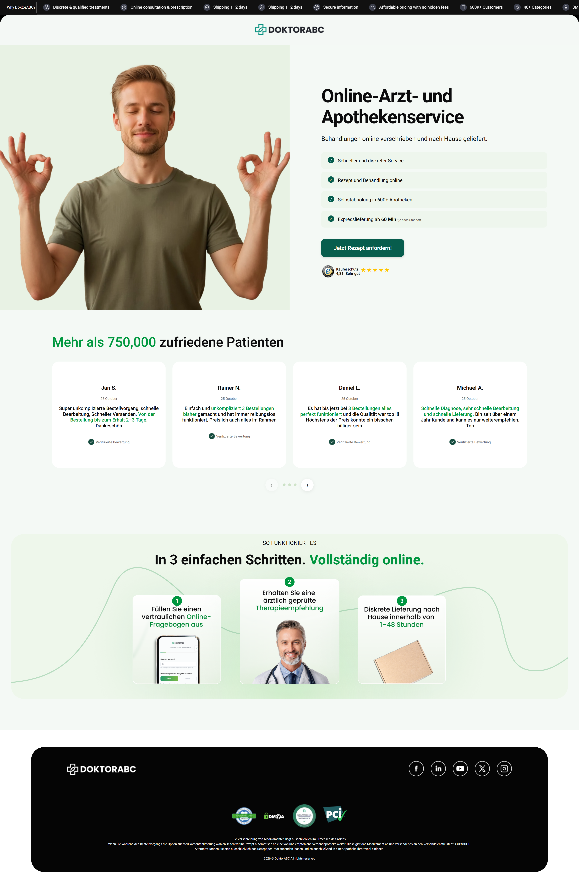
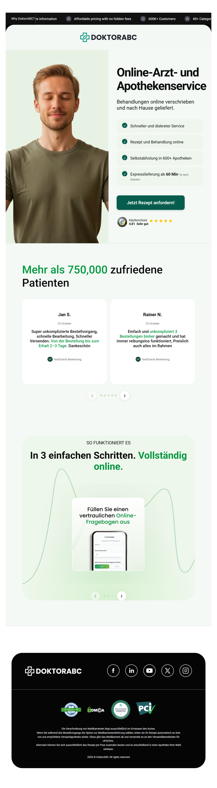
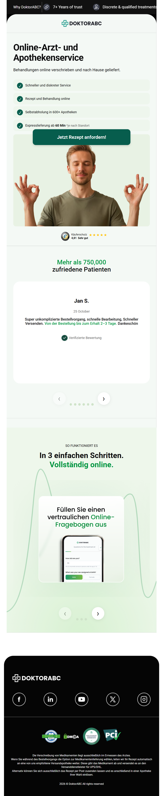
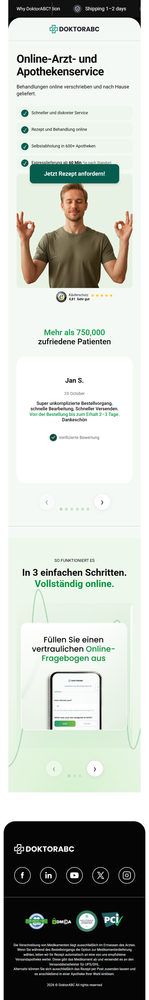

# DoktorABC Landing Page

Responsive reproduction of the supplied Figma landing page using only HTML, CSS and Vanilla JavaScript.

## Run locally

No build step or package installation is required.

1. Download/extract the project.
2. Open `index.html` in a browser.

For the most reliable local setup, you can also run a simple static server from the project folder, for example VS Code Live Server.

## Implemented

- Required hero section with `id="real_helfy_hero_section"`
- Hero / benefits / trust rating / CTA
- Patient testimonials
- How-it-works section
- Footer with certification and social assets
- Responsive layouts targeting 1920px, 1280px and 390px
- Vanilla JavaScript carousel controls on mobile
- Semantic HTML and reusable CSS classes

## Notes

- Visual assets supplied with the task are stored locally under `assets/images`.
- Social links use placeholder `#` URLs because destination URLs were not provided in the design assets.
- The Google-hosted Montserrat font is imported by CSS. If completely offline use is required, replace it with a locally licensed font file or remove the import to use the fallback font.

## Bonus — LLM review prompt

> Review this HTML/CSS/Vanilla JavaScript landing page against the supplied Figma screenshots. Check semantic HTML, accessibility, responsive behavior at 1920px, 1280px, 390px and intermediate widths, visual consistency, reusable CSS, JavaScript robustness, console errors, and horizontal overflow. Do not introduce frameworks. Return issues ordered by severity and provide focused code improvements for each issue.

## Preview

### Desktop design version

### Tablet design version

### Mobile design version

### Smaller screen size mobile version  

